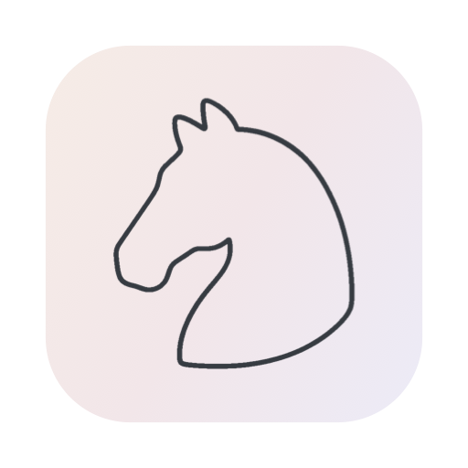
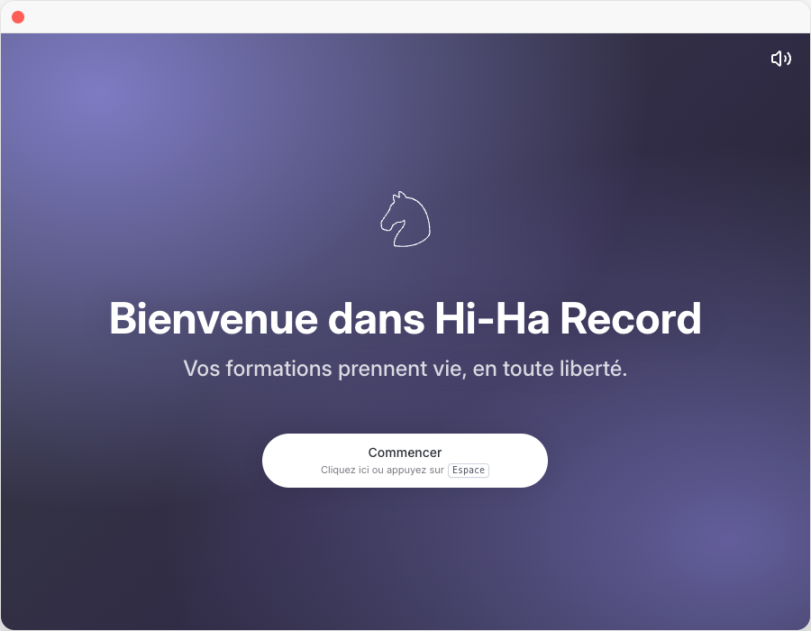

# Hi-Ha Record



Application macOS pour enregistrer, monter et exporter des vidéos de formation. Version indépendante de [Cap](https://github.com/CapSoftware/Cap), adaptée à l’identité de [Hi-Ha](https://hi-ha.be).

## État

L’interface porte le nom **Hi-Ha Record**, sans point, avec le logo cheval, la police Inter et la palette claire/sombre de Hi-Ha Voice. La compilation native Mac Apple Silicon, la compilation de l’interface et la vérification TypeScript ont réussi. Le DMG **0.6.3 pour Apple Silicon** est signé **Developer ID Application: Pixinko (85RMV67598)** et **notarié par Apple**. L’application et le DMG sont acceptés par Gatekeeper. Il remplace le premier DMG 0.6.0 signé ad hoc. Un export MP4 H.264/AAC issu d’un enregistrement réel a été vérifié. La validation complète du parcours dans l’interface native reste à terminer.

Le parcours local ne demande pas de licence commerciale Hi-Ha Record. Les pages d’achat et d’activation ont été remplacées par « À propos et licences ». Les mises à jour officielles de Cap sont désactivées pour les identifiants de cette application. Le mode Studio est sélectionné par défaut ; le sélecteur principal propose Studio et capture d’écran.

L’édition 0.6.3 fonctionne sans compte ni service cloud Cap. Les appels à leur API, la télémétrie et les rapports Sentry sont désactivés. Les modèles de sous-titres sont téléchargés à la demande depuis leurs sources indépendantes sur Hugging Face, puis utilisés localement. Le monorepo conserve les sources web et GPUI amont pour traçabilité ; elles ne constituent pas une offre commerciale Hi-Ha. L’interface native GPUI expérimentale est désactivée dans cette édition.

La version 0.6.3 corrige l’erreur « The operation is insecure » qui empêchait les aperçus caméra et l’ouverture de l’éditeur en 0.6.2.

## Télécharger

- [Hi-Ha Record 0.6.3 — DMG pour Mac Apple Silicon](https://github.com/sanma88/hi-ha-record/releases/download/v0.6.3/Hi-Ha-Record-0.6.3-arm64.dmg)
- [Sources exactes de la version 0.6.3](https://github.com/sanma88/hi-ha-record/releases/download/v0.6.3/Hi-Ha-Record-0.6.3-source.tar.gz)
- [Empreintes SHA-256](https://github.com/sanma88/hi-ha-record/releases/download/v0.6.3/SHA256SUMS.txt)
- [Notes de version et installation](https://github.com/sanma88/hi-ha-record/releases/tag/v0.6.3)

Pour proposer l’application sur un autre site, proposer également les sources correspondantes et conserver les notices légales.

## Aperçus

Captures de l’interface compilée, rendue dans un navigateur de test avec les appels natifs simulés. Elles ne valident pas la capture vidéo macOS.



- [Thème clair](docs/hi-ha-record/light.png)
- [Thème sombre](docs/hi-ha-record/dark.png)

## Licence

Copyright © 2023–présent Cap Software, Inc. et contributeurs. Adaptations Hi-Ha : 2026.

La licence principale reste l’[AGPLv3](LICENSE). Les familles de crates `cap-camera*` et `scap-*` sont sous [MIT](licenses/LICENSE-MIT). Les autres composants conservent leurs licences. La police Inter est sous [SIL OFL 1.1](licenses/Inter-OFL.txt). Voir [NOTICE.md](NOTICE.md) pour les attributions et obligations.

La licence commerciale des binaires officiels de Cap ne s’applique pas aux versions compilées soi-même, selon sa [documentation amont](apps/web/content/docs/commercial-license.mdx). Les licences du code restent applicables. Les vidéos originales ne deviennent pas AGPL du seul fait de leur enregistrement.

Lors du partage de l’application, même gratuit, fournir les sources correspondant exactement au binaire, les instructions de construction et les notices requises. Avant une livraison binaire, compléter l’inventaire des composants effectivement embarqués.

## Développement

Prérequis : Node.js 20+, Bun 1.4.0 selon le manifeste amont, Rust 1.88.0 selon `rust-toolchain.toml`, CMake 3.x et Xcode complet pour macOS. Voir [BUILDING.md](BUILDING.md) pour les instructions Mac. Docker est utilisé par la pile web amont, pas par les contrôles statiques de l’interface.

```sh
git clone https://github.com/sanma88/hi-ha-record.git
cd hi-ha-record
bun install
bun run env-setup
bun run cap-setup
bun run tauri:build
```

Les configurations Tauri portent les identifiants `be.hi-ha.record` et `be.hi-ha.record.dev`. Les données et journaux sont séparés de Cap. Le protocole de liens de cette édition est `hiha-record://` ; les intégrations externes doivent être adaptées pour l’utiliser.

La signature et la notarisation utilisent le compte Apple du mainteneur. Ne jamais ajouter les certificats privés, clés, fichiers `.env` ou enregistrements personnels au dépôt.

Voir [FORK.md](FORK.md) pour les vérifications et limites connues, et [INDEPENDENCE.md](INDEPENDENCE.md) pour les connexions et attributions. Le [README amont conservé](README.upstream.md) décrit Cap et ses services officiels.
